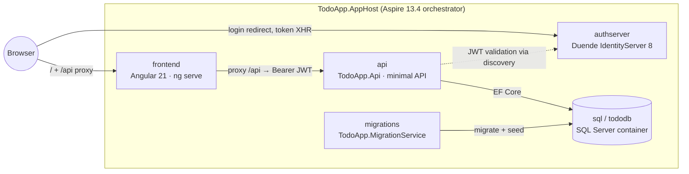
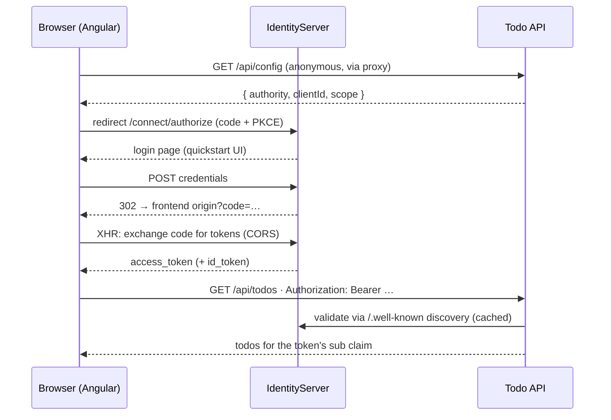

# How It Was Built

A record of the requirements, design decisions, and build process behind this Aspire todo sample. The main intent of the app is to **showcase end-to-end automation via Playwright** against a realistic distributed system — everything else serves that goal.

## Requirements

| # | Requirement |
|---|-------------|
| 1 | Aspire app (C#) with a backend + SQL database |
| 2 | Frontend that talks to that backend — **Angular** (chosen over Blazor/React during planning) |
| 3 | Classic todo sample data via Entity Framework Core |
| 4 | IdentityServer-based auth server with backend and frontend **hardcoded in C#** |
| 5 | In-memory user list, mutable through **simple unauthenticated endpoints** (add/remove user) for test seeding |
| 6 | C# Playwright test project exercising the frontend, seeding the database and auth server, and **validating created todos in the database** |
| 7 | Auth pattern: the **frontend logs the user in and uses the OAuth access token** to call the backend — explicitly *not* the BFF pattern where the backend does OpenID and the frontend holds a session cookie |

Decisions made during planning: per-user todos (exercises the auth path properly) and xUnit as the test framework (matches Aspire testing samples).

## Solution design

| Project | Role | Key packages |
|---|---|---|
| `TodoApp.AppHost` | Orchestration: SQL container, service wiring, Angular via `AddJavaScriptApp` | `Aspire.Hosting.SqlServer`, `Aspire.Hosting.JavaScript`, `Aspire.Hosting.Browsers` (preview) |
| `TodoApp.ServiceDefaults` | Health checks, OpenTelemetry, service discovery | (Aspire template) |
| `TodoApp.Data` | `TodoItem` entity, `TodoDbContext`, EF migrations, design-time factory | `Microsoft.EntityFrameworkCore.SqlServer` |
| `TodoApp.Api` | Per-user todo CRUD + anonymous `/api/config`; JWT-protected | `Aspire.Microsoft.EntityFrameworkCore.SqlServer`, `Microsoft.AspNetCore.Authentication.JwtBearer` |
| `TodoApp.AuthServer` | Duende IdentityServer 8, quickstart UI, mutable user store, `/api/users` seeding endpoints | `Duende.IdentityServer` (via `duende-is-inmem` template) |
| `TodoApp.MigrationService` | Worker: `MigrateAsync()` + idempotent seed, then exits | `Aspire.Microsoft.EntityFrameworkCore.SqlServer` |
| `frontend/` | Angular 21 SPA: OIDC code+PKCE, token interceptor, todo UI | `angular-auth-oidc-client`, `run-script-os` |
| `TodoApp.E2ETests` | Playwright E2E, boots the whole app per run | `Aspire.Hosting.Testing`, `xunit.v3`, `Microsoft.Playwright.Xunit.v3`, `Microsoft.Data.SqlClient` |

### Dynamic wiring (the central design problem)

Test runs randomize every port, yet OIDC needs exact redirect URIs and the SPA needs absolute URLs. Nothing is hardcoded; URLs flow at runtime while the config *objects* stay hardcoded C#:

1. **AppHost → AuthServer**: `authServer.WithEnvironment("FRONTEND_ORIGIN", frontend.GetEndpoint("http"))` — the C# client config reads this env var (lazily) for `RedirectUris` / `PostLogoutRedirectUris` / `AllowedCorsOrigins`.
2. **AppHost → API**: `api.WithReference(authServer)` — the API reads the authority from config key `services:authserver:http:0` for JWT validation.
3. **API → SPA**: anonymous `GET /api/config` returns `{ authority, clientId, scope }`; Angular bootstraps its OIDC config from it (`StsConfigHttpLoader`) and uses `window.location.origin` as its own redirect URL.
4. **SPA → API**: the Angular dev server proxies `/api` to the API (`proxy.conf.js` reads the Aspire-injected `services__api__http__0`), so **the API needs no CORS at all**.

Startup ordering: `api.WaitForCompletion(migrations)` guarantees the schema and seed data exist before the API serves requests; the frontend waits for the API.

## Authentication design

Token-in-the-browser SPA pattern (OIDC authorization code + PKCE, public client — `RequireClientSecret = false`):

Key decisions:

- **All-HTTP on localhost.** Avoids untrusted-dev-cert friction in headless Chromium; `http://localhost` is a trustworthy origin so `crypto.subtle` (PKCE) works. Consequences handled: `RequireHttpsMetadata = false` on the API, `ASPIRE_ALLOW_UNSECURED_TRANSPORT` on the AppHost.
- **`SameSite=Lax` session cookie.** Duende defaults its cookie to `SameSite=None`, which Chromium silently drops on non-HTTPS origins — logins "succeed" but the session never sticks. One line fixes it: `options.Authentication.CookieSameSiteMode = SameSiteMode.Lax`. *This was the only real bug found during E2E bring-up.*
- **CORS lives in exactly one place**: IdentityServer serves CORS for its token/discovery endpoints automatically from the client's `AllowedCorsOrigins`. The API is only reached through the dev-server proxy → no CORS. Login is a full-page redirect → no CORS.
- **Authorization**: the API validates the JWT (authority + `scope` claim policy for `todoapi`, audience validation off per Duende v8 defaults) and scopes every query by the token's `sub` claim. Not-owned rows return 404, indistinguishable from not-existing.

### User store

The Duende quickstart's `TestUserStore` is wrapped by a `MutableUserStore` singleton that owns the `List<TestUser>` by reference — additions/removals are immediately visible to the login UI and profile service. Unauthenticated endpoints (test seeding only — never do this in a real IdP):

| Endpoint | Purpose |
|---|---|
| `POST /api/users` `{ subjectId, username, password }` | Create user (409 on duplicate) |
| `DELETE /api/users/{username}` | Remove user (204/404) |
| `GET /api/users` | List users (debug) |

Built-in users: `alice`/`alice` (3 seeded todos), `bob`/`bob` (2 seeded todos), `user1`/`P@ssw0rd1!` (no todos; for interactive testing).

## Testing design

**One boot per run**: an xUnit collection fixture (`AppFixture`) starts the entire distributed app — SQL container, migrations, auth server, API, `ng serve` — via `DistributedApplicationTestingBuilder`, waits for `migrations` to finish and all resources to report healthy (5-minute budget for image pull + `npm ci` + first Angular build), then captures three things every test needs:

- `GetEndpoint("frontend")` / `GetEndpoint("authserver")` — the randomized URLs
- `GetConnectionStringAsync("tododb")` — for direct SQL assertions with `Microsoft.Data.SqlClient`

**Isolation without cleanup**: each test creates its own user with a GUID-suffixed username and a *test-chosen* subject ID via `POST /api/users`. Because the test picks the `sub`, it can assert rows with `WHERE UserId = @sub` — no cross-test interference, no teardown. Seeded users are only read, never mutated.

**The UI drives everything; SQL verifies it.** Playwright clicks through the real login form (`input[name='Input.Username']`, `button[value='login']`) and the todo UI (`data-testid` selectors); the database is then polled until the expected row state appears.

| Test | Exercises | DB assertion |
|---|---|---|
| `FreshUser_StartsEmpty_CreatedTodoPersistsToSql` | seed user → login → empty list → add todo | row exists for that `sub` + title |
| `SeededUser_Alice_SeesSeededTodos` | MigrationService seed data through the full auth stack | (read-only) |
| `ToggleAndDelete_AreReflectedInSql` | update + delete round-trips | `IsDone` flips; row count drops to 0 |
| `RemovedUser_CannotLogin` | `DELETE /api/users` takes effect | (login page error asserted) |

Runner: **xUnit.net v3 on Microsoft Testing Platform** (`UseMicrosoftTestingPlatformRunner` + `TestingPlatformDotnetTestSupport`, mirroring Aspire's `aspire-xunit --xunit-version v3mtp` template). The test project is a self-contained executable (`TodoApp.E2ETests.exe --list-tests`); with `dotnet test`, platform arguments go after `--` and xUnit's new filter options replace the VSTest `--filter` syntax.

## Notable environment facts

- Aspire CLI 13.4 / .NET 10 SDK / Node 24 / **Podman** 5.8 (no Docker — Aspire auto-detects it) on Windows 11.
- Duende IdentityServer 8 is free for dev/test; the startup license warning is expected.
- Playwright browsers install once via `playwright.ps1 install chromium`.

## Implementation plan (as executed, first go)

1. **Research** (parallel web agents): current Aspire 13 APIs (`AddJavaScriptApp`, SQL/EF integrations, `Aspire.Hosting.Testing`), Duende 8 in-memory config + `TestUserStore` mutability, Playwright+Aspire patterns, Angular hosting + `angular-auth-oidc-client`. Verified the local toolchain (SDKs, Podman, Node, Angular CLI).
2. **Scaffold**: `dotnet new aspire` (AppHost + ServiceDefaults), classlib/webapi/worker templates, `dotnet new duende-is-inmem` for the auth server, `dotnet new aspire-xunit` for tests, `ng new frontend`; wire packages and project references.
3. **Data layer**: `TodoItem` + `TodoDbContext` + design-time factory → `dotnet ef migrations add InitialCreate`.
4. **Services**: MigrationService worker (migrate + idempotent seed, then stop); API (JWT bearer, scope policy, `/api/config`, per-user CRUD); AuthServer (strip template config to the single `angular-spa` client + `todoapi` scope, `MutableUserStore`, `/api/users` endpoints); trim all launch profiles to HTTP-only.
5. **AppHost wiring**: SQL container + `tododb`, `WaitForCompletion(migrations)`, `FRONTEND_ORIGIN` endpoint pass-through, `AddJavaScriptApp` with `PORT` env + `npm ci` + health check.
6. **Angular**: OIDC bootstrap from `/api/config`, auth interceptor (`secureRoutes`), login/todo components with `data-testid` attributes, `proxy.conf.js`, `run-script-os` start scripts.
7. **Smoke test** (`aspire run`): verified OIDC discovery, `/api/config` URL propagation, the dev-server proxy chain, and user add/list/remove — before writing a single test.
8. **E2E tests**: fixture + four scenarios; first run exposed the `SameSite=None`-on-HTTP cookie bug (three tests stuck after login); diagnosed via browser console/network capture + Duende debug logs showing the post-login authorize request still anonymous; fixed with `CookieSameSiteMode = Lax` → **4/4 green**.

## Changes requested after initial implementation

- **Migrated the E2E project to xUnit.net v3 + Microsoft Testing Platform** (after confirming Aspire officially supports it via the `aspire-xunit` template's `v3mtp` option): `xunit.v3` 3.0.1, `Microsoft.Playwright.Xunit.v3`, MTP runner properties, `ValueTask` lifetime signatures.
- **Applied `WithBrowserLogs()`** (experimental `Aspire.Hosting.Browsers` preview package) to the frontend resource: a dashboard-launched, CDP-tracked browser streams console logs/errors into the Aspire dashboard; stays `NotStarted` during test runs.
- **Added default interactive user** `user1`/`P@ssw0rd1!` to the hardcoded test-user list (no seeded todos — clean slate for manual exploration).
